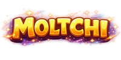

### *A companion. A shared world.*

*"Before the Moltchi hatched, the world was but a single heart of moss, ivory, and amber. When that heart shattered, its shards scattered across the world."*

https://moltchi.fr

 

Hatch your companion, train it, explore two dungeons, and go on a treasure hunt — then join forces with **every other player** to take down a World Boss that changes every week.

---

## 🔥 Pick your side — 4 species, 4 elements

| 🔥 Braisien | 🛡️ Ptimousse | 💨 Luminel | 🌑 Epineombre |
|:---:|:---:|:---:|:---:|
| **Fire** | **Earth** | **Water** | **Wind** |
| +20% Crit gained | +20% Endurance gained | +20% Magic gained | +20% Speed gained |
| Raw power | Unstoppable | 1 bonus attack/day against the Boss | For chaining attempts |

---

## 🐛 A World Boss, shared by everyone

Every week, a new boss — randomly drawn from **4 elemental bosses** — takes the previous one's place. Each has its own weakness and resistance to exploit.

> **The Ash-Worm** *(born of Fire)*
> Weak against **Water** (+20% damage) · Resists **Wind** (-10% damage)

Coordinate with other players, climb the weekly leaderboard, and share strategies in the world chat.

---

## 🗺️ Plenty to do, at your own pace

| | | |
|---|---|---|
| 🏯 **Wyrm Tower** — an endless dungeon, loot gets rarer the deeper you go | 🕯️ **Corrupt Sanctuary** — unlocked at floor 100, far more powerful loot | ⛏️ **Treasure Hunt** — dig, stack up, try your luck |
| 🎁 **Daily Chests** — a reward every day | 🎟️ **Season Pass** — daily/weekly quests, free and premium tiers | 💬 **World Chat** — talk and compare yourself with the whole community |

---

## ✦ Only one Moltyx per player, forever

**Moltyx** are fragments of the original shattered heart — only one copy possible per player, each with a unique permanent power. They're never replaced: once found, it's yours for good.

The real game isn't about climbing the highest or beating the Boss — it's about **finding every shard scattered across the world**.

 

MOLTCHI — A COMPANION, A SHARED WORLD

© 2026 MOLTCHI. All rights reserved.

